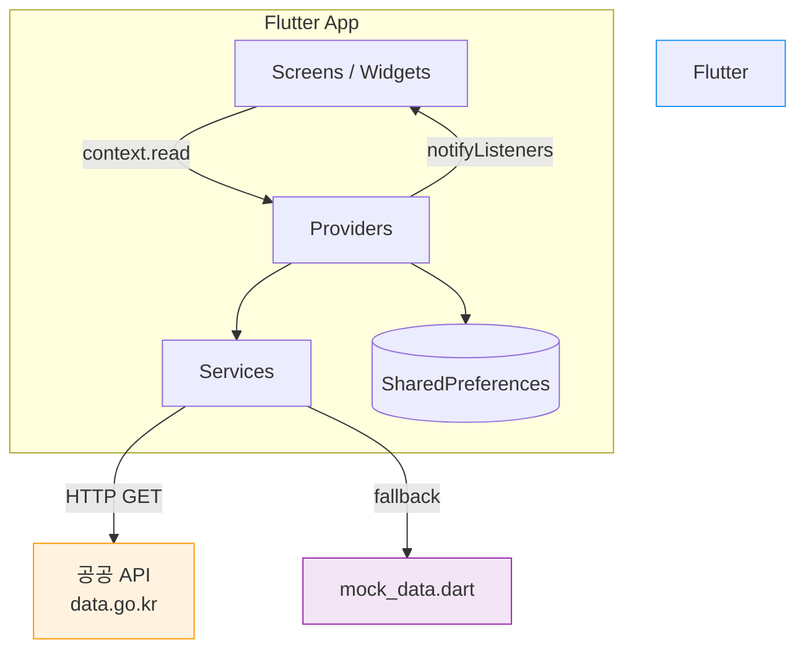

# 시스템 아키텍처

## 전체 구조



---

## 레이어 구조

| 레이어 | 디렉토리 | 역할 |
|---|---|---|
| UI | `lib/screens/`, `lib/widgets/` | 화면 렌더링, 사용자 입력 처리 |
| 상태 관리 | `lib/providers/` | 전역 상태 (Provider + ChangeNotifier) |
| 서비스 | `lib/services/` | 외부 API 호출, 데이터 가공 |
| 모델 | `lib/models/` | 데이터 구조 정의 |
| 로컬 저장 | SharedPreferences | 인증·즐겨찾기 영속 저장 |
| 다국어 | `lib/l10n/` | 한/영/중/일 문자열 관리 |

---

## 디렉토리 구조

```
lib/
├── data/
│   └── mock_data.dart          # API 오류 시 fallback 데이터
├── l10n/
│   ├── app_strings.dart        # 4개 언어 문자열 맵
│   └── terminal_names.dart     # 터미널명 번역 테이블
├── models/
│   ├── bus_model.dart          # 버스·노선·터미널 모델
│   ├── seat_model.dart         # 좌석 상태 모델
│   └── user_model.dart         # 사용자 모델
├── providers/
│   ├── auth_provider.dart      # 로그인·회원가입 상태
│   ├── booking_provider.dart   # 예약 흐름 상태
│   ├── favorite_provider.dart  # 즐겨찾기 상태 + 영속 저장
│   └── language_provider.dart  # 현재 언어 코드
├── screens/
│   ├── auth/                   # 로그인·회원가입 화면
│   ├── home_screen.dart        # 메인 홈 (터미널 검색)
│   ├── bus_list_screen.dart    # 버스 목록
│   ├── seat_selection_screen.dart  # 좌석 선택
│   ├── booking_confirm_screen.dart # 예약 확인·결제
│   ├── booking_complete_screen.dart # 예약 완료
│   ├── my_bookings_screen.dart # 예매 내역
│   └── my_page_screen.dart     # 마이페이지
├── services/
│   └── bus_api_service.dart    # 공공 API 연동
├── theme/
│   └── app_theme.dart          # 색상·타이포그래피
└── widgets/
    ├── bus_card.dart           # 버스 목록 카드
    └── seat_widget.dart        # 좌석 배치도 위젯
```

---

## 상태 관리 구조

```
MultiProvider (main.dart)
├── AuthProvider        — 로그인 상태, 사용자 정보
├── BookingProvider     — 선택된 버스, 좌석, 예약 목록
├── LanguageProvider    — 현재 언어 코드 (ko/en/zh/ja)
└── FavoriteProvider    — 즐겨찾기 터미널 목록
```

각 화면은 `context.watch<T>()` 로 상태를 구독, `context.read<T>()` 로 메서드 호출

---

## 데이터 흐름

```
사용자 입력
    │
    ▼
Screen (UI)
    │ context.read<Provider>().method()
    ▼
Provider (상태 변경 + notifyListeners)
    │
    ├──▶ Service (API 호출)
    │        │
    │        ├── 성공: 실제 데이터 반환
    │        └── 실패: mock_data.dart fallback
    │
    └──▶ SharedPreferences (영속 저장)
```

---

## 화면 네비게이션

```
MainScreen (IndexedStack)
├── Tab 0: HomeScreen
├── Tab 1: MyBookingsScreen
└── Tab 2: MyPageScreen

HomeScreen
└── Navigator.push
    ├── BusListScreen
    │   └── SeatSelectionScreen
    │       └── BookingConfirmScreen
    │           └── BookingCompleteScreen
    └── (사이드바) FavoriteTerminalsScreen / MyCardsScreen 등
```

---

## 핵심 설계 결정

자세한 근거 → `.planning/decisions/`

| 결정 | 요약 |
|---|---|
| Flutter 채택 | 단일 코드베이스로 iOS/Android 동일 UI |
| Provider 상태관리 | Flutter 공식 권장, 보일러플레이트 최소 |
| SharedPreferences 인증 | 백엔드 없이 MVP 구현 (프로토타입 한정) |
| 결정적 좌석 시뮬레이션 | 실시간 API 미지원 → seed 기반 난수 |
| AppStrings 다국어 | flutter_localizations 대신 정적 맵으로 단순화 |
