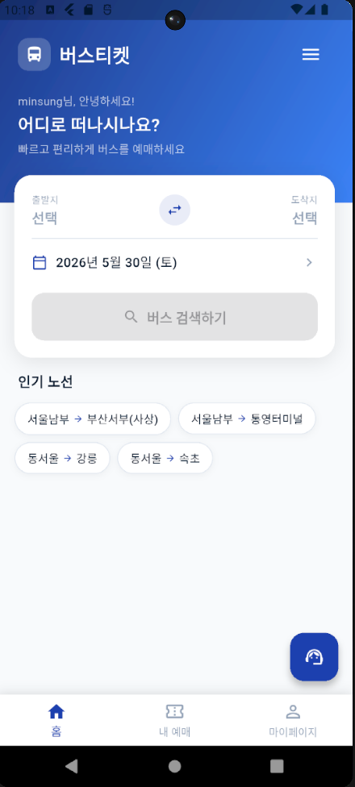

# 시외버스 통합 예약 앱
### 중간 발표

최민성 | 2026-05-31

---

## 01. 비전 & 문제 정의

<div style="text-align:center; margin:10px 0 18px;">
  <div style="background:#1a56db; color:white; border-radius:12px; padding:18px 28px; font-size:1.05em; font-weight:bold; line-height:1.6;">
    "버스 안에서 지도 앱을 따로 켜지 않아도 되는 앱"<br>
    <span style="font-size:0.78em; font-weight:normal; opacity:0.85;">예매 · 현재 위치 · 알림을 하나의 앱에서</span>
  </div>
</div>

<div class="cols2">
<div class="warn">
<span style="display:inline-block;width:22px;height:22px;background:#c2410c;border-radius:4px;color:white;font-size:13px;font-weight:900;text-align:center;line-height:22px;vertical-align:middle;margin-right:6px;">!</span> <strong>발견한 문제</strong><br><br>
시외버스 이동 중 현재 위치 확인 시<br>
<strong>지도 앱을 별도로 실행해야 하는 불편함</strong><br>
→ 기존 예매 앱은 예매 기능만 제공
</div>
<div class="box">
<span style="display:inline-block;width:22px;height:22px;background:#1d4ed8;border-radius:4px;color:white;font-size:14px;font-weight:900;text-align:center;line-height:22px;vertical-align:middle;margin-right:6px;">→</span> <strong>해결 방향</strong><br><br>
위치 확인 · 수면 알림 · 예매 · 발권을<br>
<strong>단일 앱에서 통합 제공</strong><br>
→ 시외버스 특화 올인원 플랫폼
</div>
</div>

---

## 02. 해결하려는 문제

| &nbsp; | 문제 상황 | 기존 방식 | 우리 앱 |
|---|---|---|---|
| <span style="background:#1a56db;color:white;border-radius:4px;padding:2px 8px;font-size:0.78em;font-weight:600;">위치</span> | 현재 위치 확인 | 지도 앱 별도 실행 | 앱 내 지도 *(예정)* |
| <span style="background:#7c3aed;color:white;border-radius:4px;padding:2px 8px;font-size:0.78em;font-weight:600;">수면</span> | 수면 중 도착역 놓침 | 알람 직접 설정 | GPS 수면 모드 자동 알림 |
| <span style="background:#0891b2;color:white;border-radius:4px;padding:2px 8px;font-size:0.78em;font-weight:600;">언어</span> | 외국인 이용 불편 | 한국어 전용 | 한·영·중·일 4개국어 |
| <span style="background:#059669;color:white;border-radius:4px;padding:2px 8px;font-size:0.78em;font-weight:600;">좌석</span> | 좌석 혼잡도 파악 불가 | 예매 전 혼잡도 모름 | 혼잡도 예측 시각화 |

---

## 03. 핵심 기능 전체 목록

<div class="cols2">
<div>

✅ &nbsp;터미널 검색 + 버스 조회 (공공 API)
✅ &nbsp;좌석 선택 + 혼잡도 예측
✅ &nbsp;결제 흐름 + QR 모바일 발권
✅ &nbsp;예매 내역 · 티켓 상세 조회
✅ &nbsp;GPS 기반 수면 모드 (백그라운드)
✅ &nbsp;고객센터 챗봇

</div>
<div>

✅ &nbsp;회원가입 · 로그인 · 계정 찾기
✅ &nbsp;마이페이지 · 프로필 사진
✅ &nbsp;즐겨찾기 터미널
✅ &nbsp;공지사항 · 이벤트 · 쿠폰
✅ &nbsp;4개국어 전환 (한·영·중·일)
🔜 &nbsp;**지도 기능** *(구현 예정)*

</div>
</div>

---

## 04. 기술 스택

<div class="cols2">
<div>

**개발 환경**

- Flutter 3.41 (Dart)
- VSCode · Android Studio
- GitHub

</div>
<div>

**주요 패키지 · API**

- Provider — 상태 관리
- geolocator — GPS 추적
- 공공데이터포털 API — 버스 조회
- Google Maps API — 지도 *(예정)*

</div>
</div>

---

## 05. 아키텍처

<div style="font-size:0.76em; margin-top:4px; display:flex; gap:14px;">

<!-- 메인 흐름 (왼쪽) -->
<div style="flex:3; display:flex; flex-direction:column; gap:5px;">

  <div style="background:#dbeafe; border-left:5px solid #2563eb; border-radius:7px; padding:8px 14px;">
    <strong style="color:#1e40af;">🖥️ UI Layer &nbsp;·&nbsp; Screens / Widgets</strong><br>
    <span style="color:#3b82f6;">홈 &nbsp;·&nbsp; 예매 &nbsp;·&nbsp; 마이페이지 &nbsp;·&nbsp; 로그인 &nbsp;·&nbsp; 티켓 상세</span>
  </div>

  <div style="text-align:center; color:#6366f1; font-weight:bold; font-size:1.1em; line-height:1.2;">⇅<br><span style="font-size:0.75em; font-weight:normal; color:#64748b;">watch / read</span></div>

  <div style="background:#ede9fe; border-left:5px solid #7c3aed; border-radius:7px; padding:8px 14px;">
    <strong style="color:#6d28d9;">⚡ State Layer &nbsp;·&nbsp; Provider (ChangeNotifier)</strong><br>
    <span style="color:#7c3aed;">Auth(인증) &nbsp;·&nbsp; Booking(예매) &nbsp;·&nbsp; Language(언어) &nbsp;·&nbsp; Favorite(즐겨찾기)</span>
  </div>

  <div style="display:grid; grid-template-columns:3fr 2fr; gap:10px; margin-top:2px;">
    <div style="display:flex; flex-direction:column; gap:5px;">
      <div style="text-align:center; color:#64748b; font-size:0.9em;">↓ HTTP 요청</div>
      <div style="background:#fef3c7; border-left:5px solid #f59e0b; border-radius:7px; padding:8px 14px;">
        <strong style="color:#b45309;">🔧 BusApiService</strong><br>
        <span style="color:#78716c;">공공데이터포털 API 호출</span><br>
        <span style="color:#9ca3af; font-size:0.88em;">└ 실패 시 Mock Data 자동 폴백</span>
      </div>
      <div style="display:grid; grid-template-columns:1fr 1fr; gap:5px;">
        <div style="background:#dcfce7; border-left:4px solid #16a34a; border-radius:6px; padding:7px 10px;">
          <strong style="color:#166534;">🌐 공공버스 API</strong><br>
          <span style="color:#15803d; font-size:0.88em;">data.go.kr</span>
        </div>
        <div style="background:#f3f4f6; border-left:4px solid #9ca3af; border-radius:6px; padding:7px 10px;">
          <strong style="color:#374151;">📄 Mock Data</strong><br>
          <span style="color:#6b7280; font-size:0.88em;">폴백 데이터</span>
        </div>
      </div>
    </div>
    <div style="display:flex; flex-direction:column; gap:5px;">
      <div style="text-align:center; color:#64748b; font-size:0.9em;">↕ 로컬 · 지도</div>
      <div style="background:#dcfce7; border-left:4px solid #16a34a; border-radius:6px; padding:8px 12px;">
        <strong style="color:#166534;">💾 SharedPreferences</strong><br>
        <span style="color:#15803d; font-size:0.88em;">로그인 · 즐겨찾기 · 언어</span>
      </div>
      <div style="background:#e0f2fe; border-left:4px solid #0284c7; border-radius:6px; padding:8px 12px;">
        <strong style="color:#0369a1;">🗺️ Google Maps API</strong><br>
        <span style="color:#0284c7; font-size:0.88em;">지도기능 <em>(예정)</em></span>
      </div>
    </div>
  </div>

</div>

<!-- 수면모드 흐름 (오른쪽) -->
<div style="flex:1.1; display:flex; flex-direction:column; gap:6px; border-left:2px dashed #c4b5fd; padding-left:14px; align-items:stretch;">

  <div style="text-align:center; color:#7c3aed; font-weight:bold; font-size:0.95em;">백그라운드 독립 실행</div>

  <div style="background:#fdf4ff; border-left:4px solid #a855f7; border-radius:7px; padding:8px 12px; text-align:center;">
    <strong style="color:#7e22ce;">😴 SleepModeTask</strong><br>
    <span style="color:#9333ea; font-size:0.88em;">Foreground Service</span>
  </div>

  <div style="text-align:center; color:#64748b; font-size:0.88em;">↓ 15초마다 체크</div>

  <div style="background:#fdf4ff; border-left:4px solid #a855f7; border-radius:7px; padding:8px 12px; text-align:center;">
    <strong style="color:#7e22ce;">📍 Geolocator</strong><br>
    <span style="color:#9333ea; font-size:0.88em;">GPS 위치 추적</span>
  </div>

  <div style="text-align:center; color:#64748b; font-size:0.88em;">↓ 목적지 반경 진입</div>

  <div style="background:#fff7ed; border-left:4px solid #f97316; border-radius:7px; padding:8px 12px; text-align:center;">
    <strong style="color:#c2410c;">🔔 진동 알림</strong><br>
    <span style="color:#ea580c; font-size:0.88em;">2 / 5 / 10km 선택</span>
  </div>

</div>

</div>

---

## 06. 화면 구성



```
MainScreen (하단 탭 3개)
│
├── 🏠 홈
│    터미널 검색 → 버스 목록
│    → 좌석 선택 → 결제 → 완료
│
├── 🎫 내 예매
│    예정된 여행 / 지난 여행
│    └── 티켓 상세
│         (QR코드 + 수면모드 + 지도)
│
└── 👤 마이페이지
     내 정보 수정 · 프로필 사진
     즐겨찾기 / 쿠폰 / 공지 / 이벤트

로그인 ── 회원가입 / 계정 찾기
```

---

## 07. 핵심 구현 — GPS 수면 모드

**"자다가 목적지 근처에 오면 자동으로 깨워준다"**

```dart
void onRepeatEvent(DateTime timestamp) async {
  final pos = await Geolocator.getCurrentPosition(...);
  final dist = Geolocator.distanceBetween(
    pos.latitude, pos.longitude, _destLat!, _destLng!,
  );
  if (dist <= _alertMeters) {
    FlutterForegroundTask.sendDataToMain({'action': 'wake_up'});
  }
}
```

<div class="cols2">
<div>

- 화면 꺼진 상태에서도 동작 (Foreground Service)
- 15초마다 GPS 위치 체크

</div>
<div>

- 2km / 5km / 10km 전 알림 선택 가능
- 도착 시 **강한 진동**으로 알림

</div>
</div>

---

## 08. 핵심 구현 — 고객센터 챗봇

**"자주 묻는 질문을 채팅 형식으로 즉시 안내"**

<div class="cols2">
<div>

**동작 방식**

- 사용자 입력 키워드 → FAQ 매칭
- 빠른 질문 버튼으로 원터치 선택 가능
- 답변 없을 경우 안내 메시지 출력

<br>

**지원 질문 유형**

| 키워드 | 내용 |
|---|---|
| 취소 · 환불 | 예매 취소 방법 · 환불 정책 |
| 발권 · QR | 모바일 발권 사용법 |
| 짐 · 수하물 | 수하물 허용량 안내 |
| 언어 · language | 언어 변경 방법 |
| 회원가입 · 로그인 | 가입 없이 예매 가능 여부 |

</div>
<div>

<div class="box" style="margin-top:8px;">
🤖 <strong>챗봇 예시 대화</strong><br><br>
<span style="color:#555; font-size:0.85em;">
👤 예매 취소하고 싶어요<br><br>
🤖 마이페이지 → 예매내역에서<br>
&nbsp;&nbsp;&nbsp;&nbsp;취소할 예매 선택 후 [취소] 버튼<br><br>
&nbsp;&nbsp;&nbsp;&nbsp;출발 1시간 전까지 100% 환불
</span>
</div>

</div>
</div>

---

## 09. 개발 한계 — 실시간 좌석 조회

<div class="warn">
⚠️ <strong>실시간 좌석 API는 터미널 측 독점 유료 서비스</strong>로<br>
공공데이터포털에서도 제공하지 않아 연동 불가
</div>

**대응 방식: 결정적 난수(seed)로 일관된 좌석 데이터 직접 생성**

<div class="cols2">
<div>

- 버스 ID + 날짜를 seed로 사용
- 같은 버스·날짜면 **항상 동일한 좌석 배치**
- 혼잡도 40% 기준으로 점유/공석 분류

</div>
<div>

- API 없이도 **자연스러운 좌석 선택 UX** 제공
- 실제 예매 시스템 연동 시 대체 가능한 구조로 설계

</div>
</div>

---

## 10. 구현 예정 — 지도 기능

**주제 선택의 핵심 동기: "앱 하나로 현재 위치 확인"**

<div class="cols2">
<div>

**계획 기능**

- 📍 현재 위치 실시간 표시
- 🚉 출발지 터미널 핀 표시
- 🏁 도착지 터미널 핀 표시
- 🛣️ 이동 경로 시각화

</div>
<div>

**준비 현황**

- `geolocator` 패키지 이미 연동 완료
- 티켓 상세 화면에 **지도 버튼** 배치 완료
- 구현 기술: **Google Maps API**

</div>
</div>

---

## 11. 진행 현황

| 주차 | 상태 | 내용 |
|---|---|---|
| 10주차 | ✅ 완료 | 기획 · 일정 수립 |
| 11주차 | ✅ 완료 | 설계 · 환경 구성 |
| 12주차 | ✅ **현재** | 핵심 기능 완성 **(중간 발표)** |
| 13주차 | 🔜 예정 | UX 개선 · QR발권 고도화 |
| 14주차 | 🔜 예정 | 지도 기능 구현 |
| 15주차 | 🔜 예정 | 마무리 · 최종 발표 |

<br>

> Must 기능 핵심 구현 **완료** / Should 기능 순차 개발 예정

---

## 감사합니다

**GitHub** : https://github.com/minsung6167/Bus_app

**문의** : minsung1408@g.shingu.ac.kr

<br>
<br>

> *"버스 안에서 지도 앱을 따로 켜지 않아도 되는 앱"*
